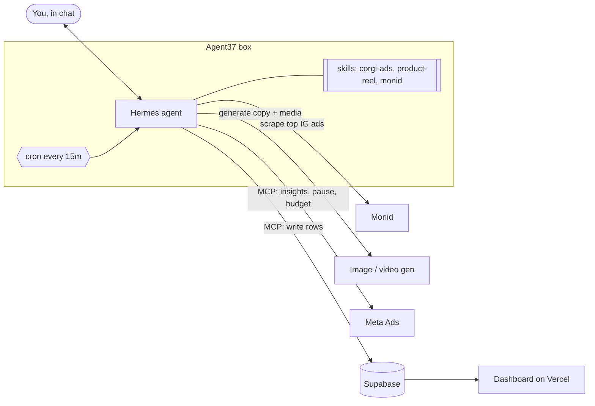

# Corgi Ads 🐕📣

An ad agent you talk to. It studies what's working for competitors, makes the
creative, launches it on Meta, then watches live spend and tells you where the
money should go. You approve; it acts.

Built at the Corgi Hackathon by Ben and Zen.

## Live links

| What | URL |
|---|---|
| Demo page | https://corgi-hack-tau.vercel.app |
| Corgi Pop landing page (ad click-through) | https://corgi-hack-tau.vercel.app/corgi-pop/ |
| Agent console (Claude + Meta ads MCP, passcode) | https://corgi-hack-tau.vercel.app/agent/ |
| Muse agent (Agent37 on Instacloud, password) | https://prod-muse-instacloud-muse-07ee54-007x05v54jj.compute.instacloud-edge.com |

**Vercel:** project `benjamin-shyong/corgi-hack`, site code in `landing/`, deployed from branch
**`ben/meta-setup`**. To deploy: `cd landing && vercel deploy --prod --scope benjamin-shyong`.

## Architecture



| Step | What happens | Where |
|---|---|---|
| 1. Research | Monid pulls the top 5 competitor Instagram ads. Agent names the hook, format, offer. | `competitor_ads` |
| 2. Create | Agent writes 3 variants with different hooks; `product-reel` turns product photos into finished video ads. | `creatives` |
| 3. Launch | Agent picks manual vs Advantage+ and says why, then creates the ads on Meta. | Meta, `creatives.meta_ad_id` |
| 4. Monitor | Cron reads ad-level insights, snapshots them. | `ad_snapshots` |
| 5. Direct spend | Agent proposes pause or budget shift. You say "approve". It applies and confirms. | `recommendations`, Meta |

**Design rule:** the agent is the only thing that touches Meta. The dashboard
only reads Supabase. That keeps the token in one place and the UI dumb.

## Repo layout

```
hermes/
  config.mcp.yaml              MCP servers to merge into ~/.hermes/config.yaml
  skills/marketing/corgi-ads/  Monitor + recommend + guardrails skill
  skills/marketing/product-reel/  Product photos → reel, cover, caption + media checks
supabase/schema.sql            Shared data contract (agent writes, web reads)
web/                           Dashboard
muse/                          Private Muse chat app, deployed on Instacloud
docs/demo.md                   3-minute demo script and backups
.env.example                   Every secret we need. Real values never get committed.
```

## Who owns what

Proposed split. Swap freely, just update this table.

| Lane | Owner | Done when |
|---|---|---|
| Meta account, live $10 campaign, 3 ads | Ben | Ads approved and delivering |
| Hermes on Agent37: MCP + corgi-ads skill + cron | Ben | "list my ad accounts and today's spend" works in chat |
| Monid research skill | Zen | Agent returns 5 competitor ads + analysis, rows in `competitor_ads` |
| Supabase project + schema | Zen | `schema.sql` applied, agent can insert |
| Dashboard (`web/`) | Zen | Performance chart updates from `ad_snapshots` |
| Demo script + backup recording | Both | See `docs/demo.md` |

## Setup

**Muse chat app (Instacloud)**

The working agent UI lives in [`muse/`](muse/README.md). It includes chat, Ideas,
Goals, Library, password sign-in, and an in-app Skills screen. The existing
Instacloud deployment and Pip instance are reused; moving the source here does
not reset the agent or its memory.

From `muse/`, run `npm ci`, `npm test`, then `npm run deploy`. Deployment bundles
the canonical files in `hermes/skills`, including `corgi-ads`, `product-reel`, and
the official `monid` skill, plus their scripts and references. New agents install
them during onboarding; existing agents sync them on their next app visit. The
Skills screen also offers a refresh button. Start a new chat after a skill update.

Set `MONID_API_KEY` as an Instacloud secret scoped to `compute/muse`. Muse installs
the Monid CLI in the agent's persistent home and configures its local credential
store automatically. The key is supplied by the deployment, not committed in git
or sent to the browser. Monid research/generation bills to the Monid workspace.

Muse itself uses its persistent `/data/store.json` and needs no database. The
Supabase schema below is for shared ad data and the separate dashboard. Installing
the Corgi Ads skill does not connect Meta or Supabase: complete the relevant setup
below before asking Pip to operate ads. No ad campaign or monitor is launched by
deploying Muse.

**Meta access** (people get roles, the agent gets a system user)
1. business.facebook.com: one Business portfolio owns the ad account and the Facebook Page.
2. People: Business settings > Users > People > Add, invite Ben and Zen by email, give each full control of the ad account and Page.
3. Agent: Business settings > Users > System users > Add with the **Employee** role (Admin-role tokens are rejected by Meta's ads MCP server). Assign the ad account and the Page with full access, plus the app. Generate a token that includes `ads_mcp_management`, `ads_management`, `ads_read`, `business_management`. That token goes in `~/.hermes/.env` as `META_ACCESS_TOKEN`. Current state and IDs: [docs/meta-setup.md](docs/meta-setup.md).
4. Billing > Payment settings: account spending limit $15.

**Agent (Agent37 box)**
1. `cp .env.example ~/.hermes/.env` and fill it in.
2. Merge `hermes/config.mcp.yaml` into `~/.hermes/config.yaml`. Start with option A, then `/reload-mcp`.
3. Smoke test in chat: *"list my ad accounts and today's spend"*. If it fails, try option B, then C.
4. Install the bundled skills:
   ```sh
   mkdir -p ~/.hermes/skills/marketing
   cp -R hermes/skills/marketing/corgi-ads hermes/skills/marketing/product-reel ~/.hermes/skills/marketing/
   ```
5. Monid: `monid keys add -k "$MONID_API_KEY" -l main`, and load Monid's SKILL.md into Hermes.
6. Schedule the monitor (gateway must be running):
   ```
   hermes cron create "every 15m" "Run the corgi-ads monitor loop and report" --skill corgi-ads
   ```

**Product reel creation**

Attach product photos and ask: *"Use product-reel to make a 20-second Instagram
ad for young adults with a playful summer feel, music, a cover, and a caption."*
The [skill](hermes/skills/marketing/product-reel/SKILL.md) includes creative
direction, Monid production guidance, and a local media checker. The agent host
needs Python 3, FFmpeg (including ffprobe), and authenticated Monid access for
Monid generation. It uses available image tools or discovers an image endpoint
through Monid; Codex's built-in image generator is optional.

The result is a local MP4, cover, caption, and editable source assets. Generation
can spend Monid credits. Publishing the creative or launching a Meta ad is a
separate action from making the reel.

**Supabase**
1. New project. Run `supabase/schema.sql` in the SQL editor.
2. Agent writes with a personal access token through the Supabase MCP. Dashboard reads with the anon key.

## Live test campaign

- Objective **Traffic** (no pixel needed), destination = landing page.
- One ad set, **3 ads** with different hooks, so there's something to compare.
- **$10 lifetime budget** with an end date. Broad targeting, Advantage+ placements.
- Expect real spend, CTR, CPC, CPM. Not real ROAS: that needs a pixel and purchases.

## Working together

- Branch per lane (`ben/agent`, `zen/web`), PR into the main branch, keep PRs small.
- `supabase/schema.sql` is the contract. Change it in its own PR and tell the other person.
- Secrets live in `.env` and `~/.hermes/.env` only. If a key ever lands in git or a shared doc, rotate it.
