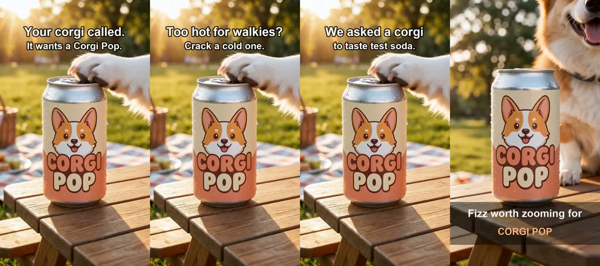

# Example ads: Corgi Pop

Three 15-second vertical (9:16, 720p) video ads for the fictional Corgi Pop soda, plus the hero image.
Same footage in all three; only the hook text and end card change. That makes them a clean A/B test
of the hook, which is what the agent compares on CTR and cost per ThruPlay.

| File | Hook (0–4s) | End card (last 3s) |
|---|---|---|
| `corgi-pop-zoomies.mp4` | "Your corgi called. / It wants a Corgi Pop." | "Fizz worth zooming for" |
| `corgi-pop-beat-heat.mp4` | "Too hot for walkies? / Crack a cold one." | "Ice cold. Corgi approved." |
| `corgi-pop-taste-test.mp4` | "We asked a corgi / to taste test soda." | "Verdict: 10/10 boops" |
| `corgi-pop-hero.png` | Product image, used as the first frame and as the video thumbnail | |

## How they were made

1. Hero image: Runway image generation, 9:16.
2. Base clip: Runway image-to-video from the hero image, 15s, 720p, with audio.
3. Variants: `python3 make-variants.py base.mp4` overlays the hook and end card (Pillow + ffmpeg, free).

One 15s Runway clip costs about 435 credits, so the variants share one clip.

## Using them in a Meta ad (via Hermes / ads MCP)

Meta needs a public direct URL to upload a video, so use the raw GitHub URL, e.g.
`https://raw.githubusercontent.com/benikigai/corgihack/<branch>/examples/ads/corgi-pop-zoomies.mp4`.
The hero image is already in the ad account (image hash `02f6b2c9987749dafb500286e856362e`).
Then follow "Video ad flow over MCP" in [`docs/meta-setup.md`](../../docs/meta-setup.md).
